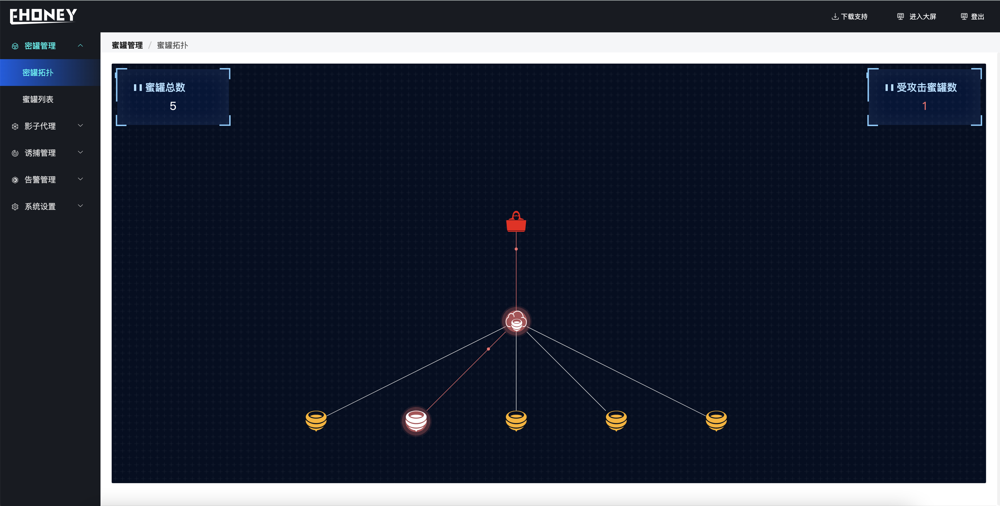
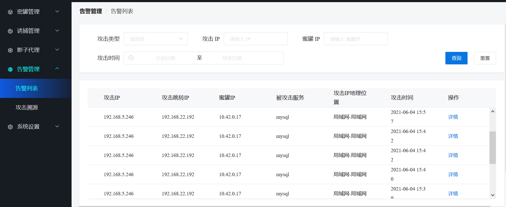

<p align="center">
  
  <br/>
  <br/>
   <br> English | <a href="README.md">中文</a>
  <h1 align="center">Welcome To Ehoney 👋</h1>
  <br/>
  <p align="center">
  
  
  
  
  </p>
</p>


> ⭐️ The eSign security team has accumulated more than ten years of security experience and will gradually open to users. The "Ehoney" deception defense system is a cloud-native deception defense system, and it is also the only open source product in security fields that is benchmarked against commercial systems. The defense system deploys high-interaction and high-simulation "honeypots" and traffic proxy forwarding, combined with self-developed secret signatures and decoys, to direct attackers to the honeypots to disrupt the guidance and delay attacks, which can protect the business to a large extent safety.⭐️   


🏠 [Documentation](https://seccome.github.io/Ehoney/) &nbsp;&nbsp; :triangular_flag_on_post: [Demo Site](http://47.98.206.178:8080/decept-defense)   

## 📝 Features

- **Support abundant honeypot types**

1. **General honeypot**： SSH honeypot, Http honeypot, Redis honeypot, Telnet honeypot, Mysql honeypot, RDP honeypot
2. **IOT honeypot**：  RTSP honeypot
3. **Industrial control honeypo**： ModBus honeypot

- **Based on cloud native technology**<br>
  build saas platform deception defense based on k3s, generate unlimited honeypots, and simulate the business environment

- **The unique secret signature technology in esignature field**<br>
  original secret signature technology supports more than 20 kinds of secret signatures, such as documents, pictures, emails, etc.

- **Powerful Bait**<br>
  Support dozens of kinds of bait, manage by probe to deceive and deception drainage

- **Visualized topology**<br>
  can visually display the attack view, visualize all attacks, and form a complete attack link

- **Dynamic countermeasure technology**<br>
  Based on the prediction algorithm of LSTM, it can predict the hacker's next attack method, dynamic deception, delay the hacker attack time, and protect the real business

- **Powerful customization**<br>
  Support custom secret signatures, decoys, honeypots, etc., plug-in installation and deployment to meet many feature requirements

## ⛴ Running environment

- **Operating system**: CentOS 7 and above
- **Minimum configuration：**: Memory 4G, disk space above 10G
- **Recommended configuration：**: Memory 8G, disk space above 30G


## 🔧 Rapid deploy

```shell
git clone https://github.com/seccome/Ehoney.git
cd Ehoney && chmod +x quick-start.sh && ./quick-start.sh

# This installation process will be time-consuming and patient

**all the services are ready and happy to use!!!**
# It means the installation is successful.
```

You can visit `http://IP:8080/decept-defense` in browser and will see the login page

Default account:
       <font color=Blue>username: `admin`</font>
       <font color=Blue>password: `123456`</font>

<br>

## 🖥️ Demo


<br>

## 🚀 Show results

- **Attack display**


- **HoneyPot topology**



- **Alarm list**




## 🙏 Contact 

1. GitHub issue: [new issue](https://github.com/seccome/Ehoney/issues/new )
2. QQ Group: 597605141
3. Email: ask@seccome.com
4. Wechat Group: 


