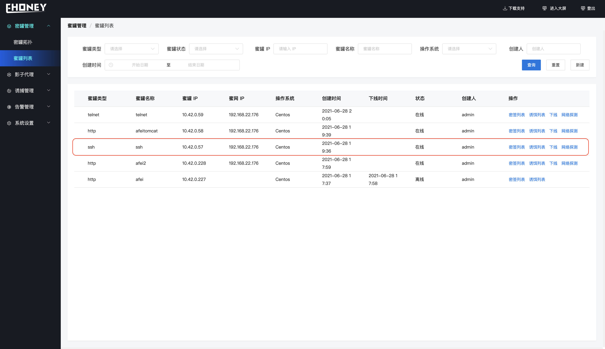
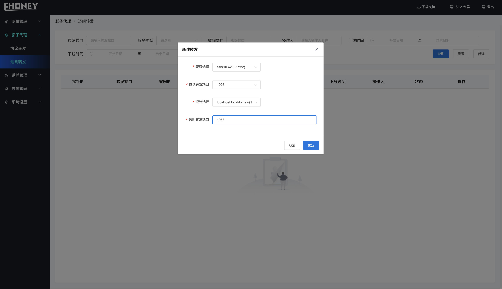

### 1. 创建蜜罐

**蜜罐管理>>>蜜罐列表>>>新建**

**创建成功后、蜜罐列表显示蜜罐信息、同时可对蜜罐进行下线、存活探测等操作**

### 2. 创建协议转发

**影子代理>>>协议转发>>>新建**

**创建成功后、显示如下、协议转发表示建立了蜜网端口到蜜罐端口的流量转发、样例创建的协议转发将1026端口的ssh流量转发到IP地址为10.42.0.57:22的蜜罐中**

### 3. 创建透明转发

**影子代理>>>透明转发>>>新建**

**创建成功后、显示如下、透明转发表示建立了探针端口到蜜网端口的流量转发、样例创建的透明转发将1063端口的流量转发到蜜网的1026端口**

> 完成上述几个步骤后、当黑客探测到业务服务器的1063端口并进行攻击时、就会将黑客引诱到ssh服务蜜罐中、同时探针以及蜜罐可以部署密签、诱饵等诱使黑客对蜜罐的攻击、延缓以及防治业务服务被攻击。具体请详读功能说明

