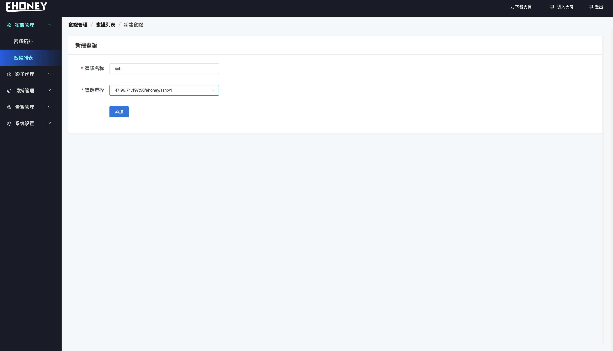
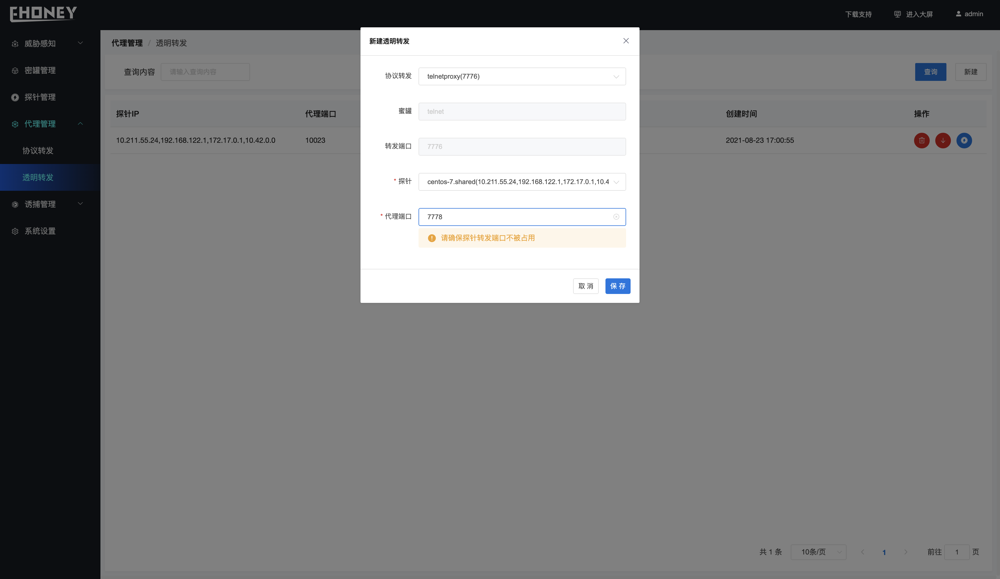

### 1. 创建蜜罐

**蜜罐管理>>>新建**

**创建成功后、蜜罐列表显示蜜罐信息、状态为成功**

### 2.部署探针服务器

1. 点击右上角的下载支持，将压缩包拷贝到即将部署的服务器上。

2. 解压文件tar -zxvf decept-agent.tar.gz

3. 修改解压目录中的conf目录下的agent.json，修改strategyAddr参数ip为redis地址的ip，默认安装为当前服务器ip 以及strategyPass的值为redis的密码默认为123456。修改sshKeyUploadUrl的ip尾web服务的ip，默认安装为当前服务器ip。(尽量不要把探针部署在服务端所在的机器。原因是服务端默认已部署了一台探针服务器作为协议代理Agent, agentid 系统唯一)

4. 执行 chmod +x decept-agent &&  ./decept-agent -mode=EDGE

5. 查看启动日志和探针列表是否有此探针服务确认启动是否正常(由于agent端口判断需要，需提前安装lsof)。

### 3. 创建协议转发

**代理管理>>>协议转发>>>新建**

**创建成功后、显示如下、协议转发表示建立了蜜网端口到蜜罐端口的流量转发、样例创建的协议转发将1026端口的ssh流量转发到IP地址为10.42.0.57:22的蜜罐中**

### 4. 创建透明转发

**影子代理>>>透明转发>>>新建**

**创建成功后、显示如下、透明转发表示建立了探针端口到蜜网端口的流量转发、样例创建的透明转发将1063端口的流量转发到蜜网的1026端口**

> 完成上述几个步骤后、当黑客探测到业务服务器的1063端口并进行攻击时、就会将黑客引诱到ssh服务蜜罐中、同时探针以及蜜罐可以部署密签、诱饵等诱使黑客对蜜罐的攻击、延缓以及防治业务服务被攻击。具体请详读功能说明

