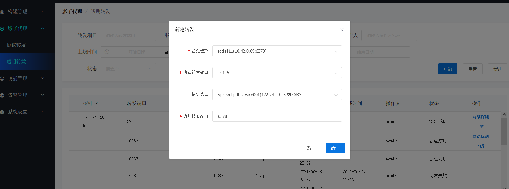

## 概念
* 伪装代理是由部署在业务服务器上的探针Agent实现。
* 能够开启业务相似的端口并能通过协议**代理**把攻击流量转发至对应的蜜罐中, 实现诱捕功能。
* 能够部署文件诱饵以及蜜签

## 使用说明
### 1. 创建透明转发
* 在**影子代理**下的**透明转发**列表点击**新建**按钮, 选择对应的**蜜罐**、**协议代理**、**探针**,最后输入需要转发的端口，并点击确认按钮创建。
  

## 实现设计
* 是探针agent中的一个模块，由透明代理agent管理。
* 通过Redis消息订阅模式接收服务端下发透明代理策略触发透明代理的启动。
* 根据透明代理策略启动对代理端口监听以及对代理IP和端口进行转发功能的程序。

