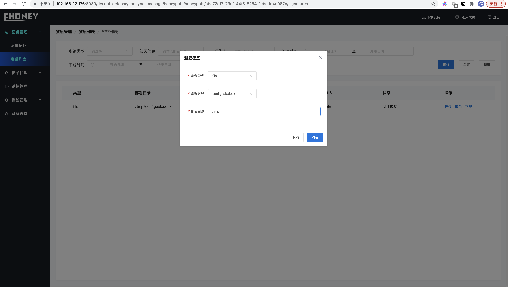

## 蜜罐列表

>蜜罐管理>>>蜜罐列表

1. **按照条件查询特定蜜罐信息**
2. 新建蜜罐、可以选择不同的镜像创建不同的服务蜜罐（镜像通过harbor管理、后面会介绍如何设置harbor地址）
3. **密签列表、可以部署密签文件到指定的蜜罐中、当密签文件被打开时会显示攻击者的详细信息**

> 新建蜜罐密签时可以选择密签类型（当前支持file类型）、选择密签文件以及部署在蜜罐中的路径

> 当部署的密签文件被打开时、密签的详情页面会显示打开者的UA、IP等信息

4. 诱饵列表、新建诱导诱饵、当前支持文件形式诱饵
5. 下线操作可以禁用当前蜜罐
6. 网络探测检测当前蜜罐是否在线