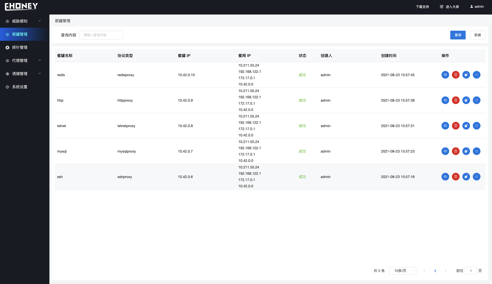
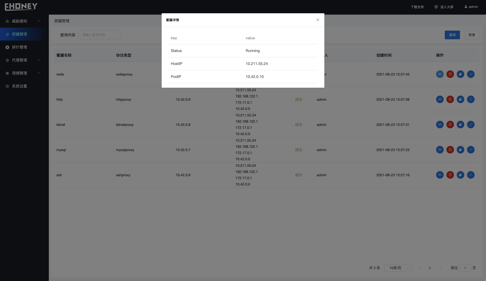

## 蜜罐管理

>蜜罐管理

- **字段解释**

1. 蜜罐名称 - 创建蜜罐时指定的名称、**不能重复**

2. 协议类型 - 进行协议转发的协议类型名称
3. 蜜罐IP     - 蜜罐IP地址
4. 状态        - 蜜罐当前状态
5. 创建人    - 创建蜜罐用户
6. 创建时间- 创建蜜罐时间
7. 操作        - 其他操作

- **功能介绍**

1. 创建蜜罐

> 点击新建、指定蜜罐名称以及镜像地址进行创建蜜罐操作

2. 查询操作

> 在查询内容输入框输入查找关键词进行模糊搜索

3. 其他操作

从左到右依次

- 蜜罐详情、显示蜜罐的具体运行信息

- 删除蜜罐、 删除指定蜜罐
- 蜜罐密签、部署密签到蜜罐中某个路径下

> 指定密签名称以及部署路径

- 蜜罐诱饵、部署诱饵到蜜罐中某个路径下

> 指定密签名称、指定部署方式

