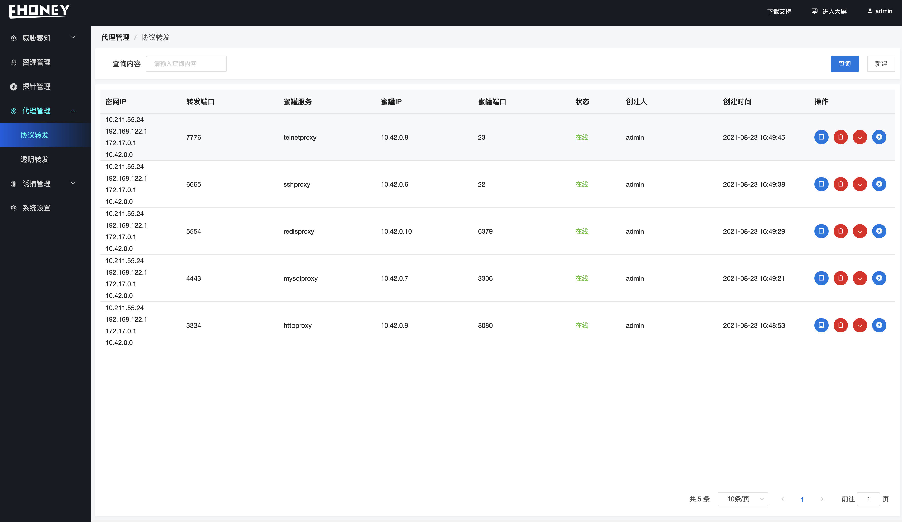
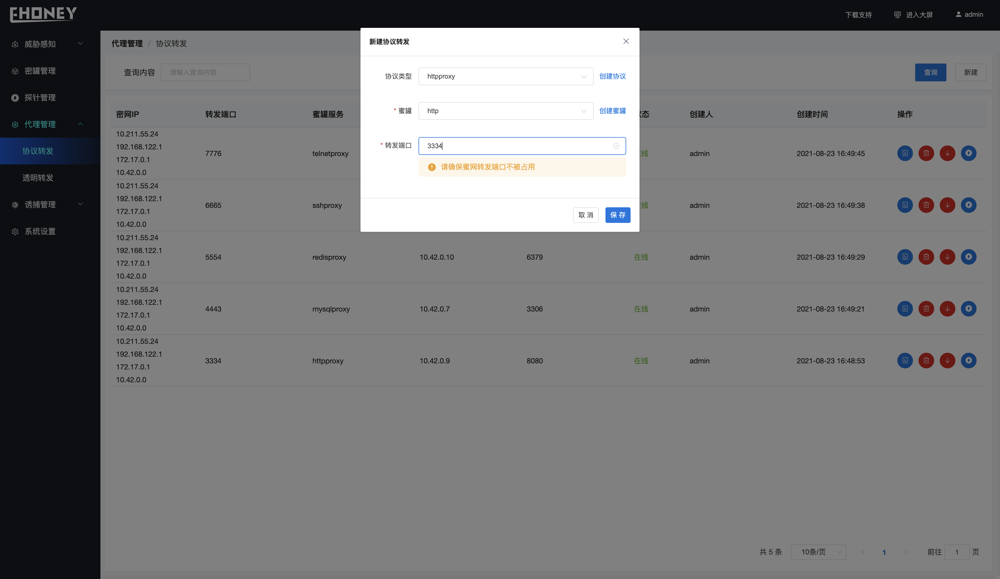
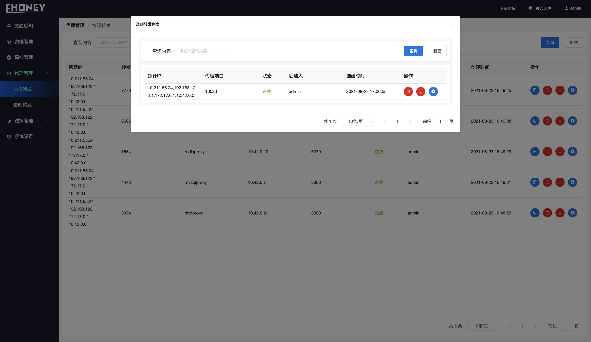

## 协议转发

> 代理管理 >>  协议转发

>  协议转发能够将固定的协议流量直接转发到对应的蜜罐中、同时能够对流量进行记录、解析并上报异常信息.

- **字段解释**

1. 蜜网IP     - 蜜罐所在服务器的IP地址

2. 转发端口 - 协议转发的转发端口
3. 蜜罐服务 - 蜜罐启动的协议服务名称
4. 蜜罐IP     - 蜜罐IP地址
5. 蜜罐端口 - 蜜罐端口
6. 状态         - 蜜罐状态
7. 创建人     - 创建用户 
8. 创建时间- 创建蜜罐时间
9. 操作        - 其他操作

- **功能介绍**

1. 创建协议代理啊

> 点击新建、按照协议类型选择转发蜜罐、选择转发端口

2. 查询操作

> 在查询内容输入框输入查找关键词进行模糊搜索

3. 其他操作

从左到右依次

- 创建透明转发

- 删除协议转发、同时会删除关联的透明转发
- 上线、下线协议转发
- 网络探测、探测当前协议转发的状态