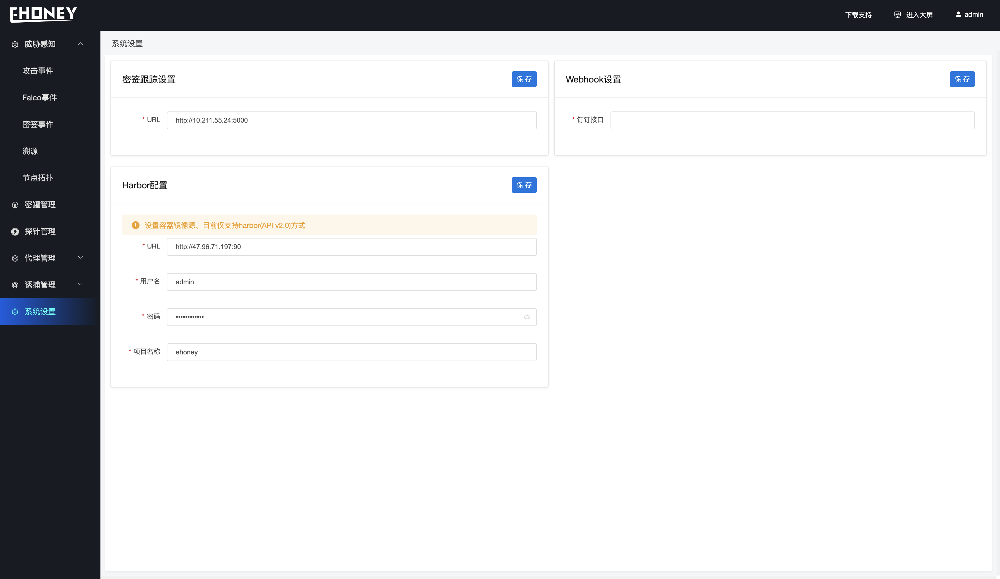

## 系统设置

> 系统设置可进行密签跟踪服务器设置、Harbor源配置以及钉钉webghook设置

- 密签跟踪设置

> 设置密签跟踪服务器地址、一键脚本安装的默认地址为http://IP:5000

- Harbor源配置

> 提取镜像信息的API版本为2.0、设置可以指定harbor的URL、用户名、密码以及项目名

**！！！ 注意：如果设置自定义harbor 需要修改 /usr/lib/systemd/system/docker.service 文件** 
**设置 ExecStart=/usr/bin/dockerd --insecure-registry=47.96.71.197:90" 中的 --insecure-registry的值为harbor地址。**
**并执行 1、sudo systemctl daemon-reload  2、sudo systemctl restart docker**

- webhook配置

> 用来设置钉钉的webhook参数、可以进行自定义告警、系统默认会对透明转发以及协议转发进行告警、展示攻击的具体信息进行实时告警。

