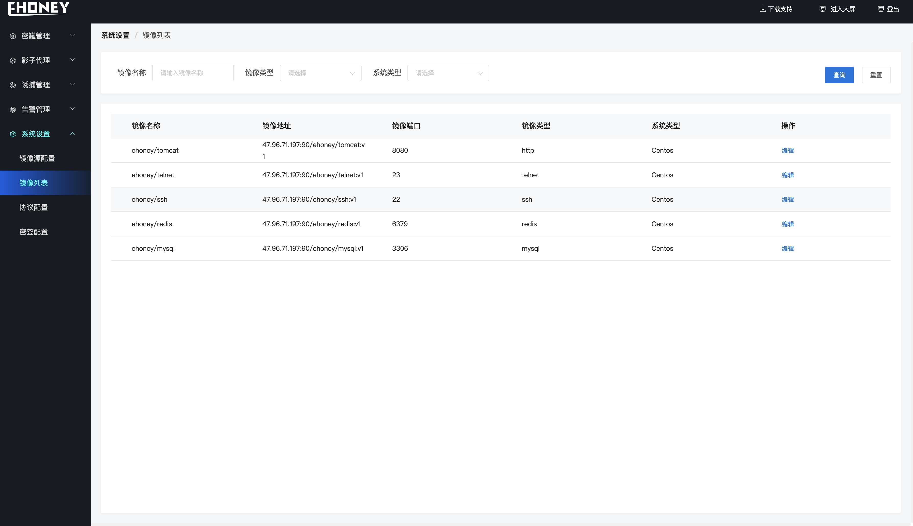

## 系统设置

> 系统设置可进行镜像源配置、查看镜像列表、进行协议配以及密签跟踪服务器设置

**镜像源采用harbor为镜像源、版本为2.0、指定harbor的URL、用户名、密码以及项目名**

**镜像列表展示当前可用来创建蜜罐的镜像列表**

!!! 注意： 这里可以对镜像的端口进行设置、当前端口是确定的、除非你明确修改的意义、否则请不要随意修改

**进行协议转发的服务**

**密签跟踪服务器设置**

