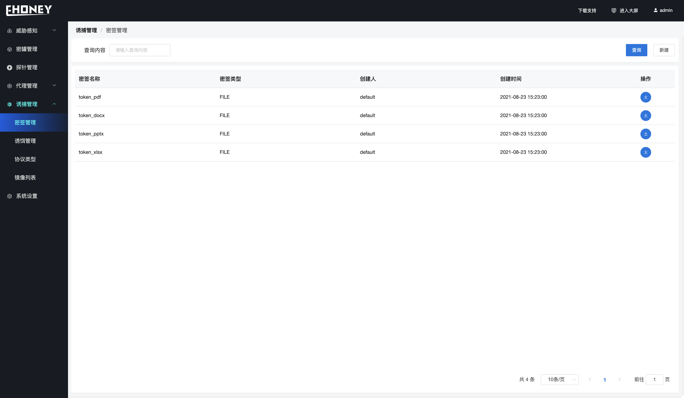
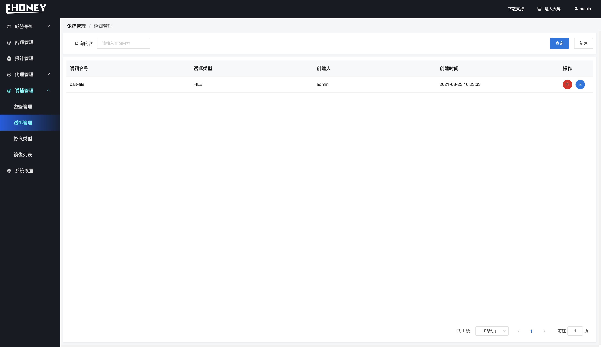
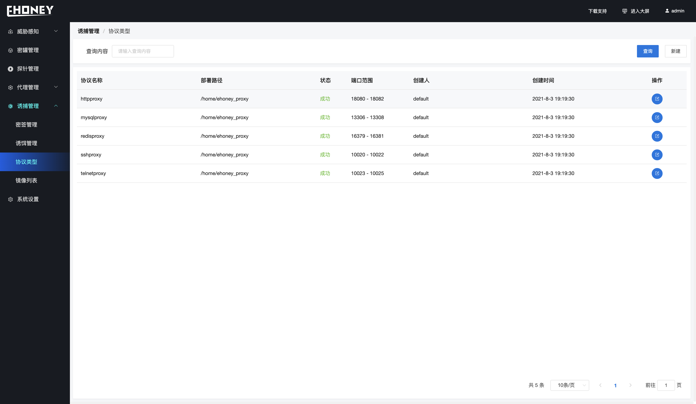
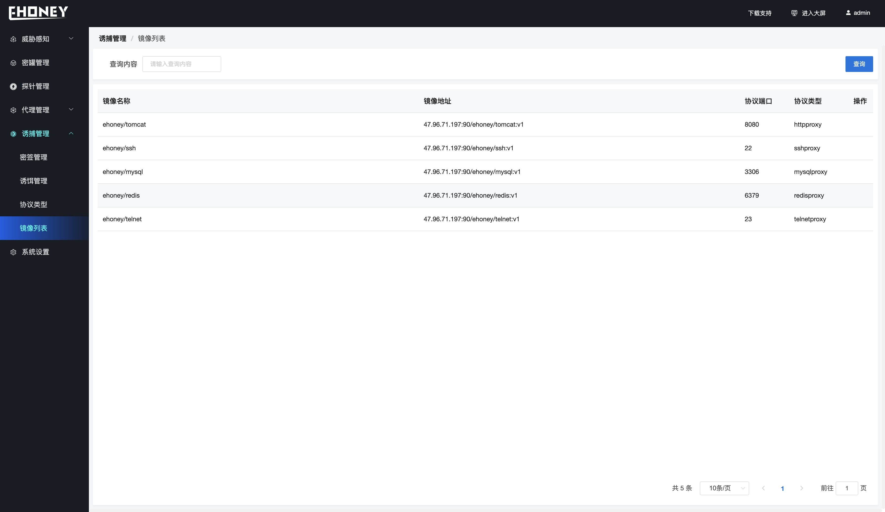

## 诱捕管理

> 次页面可以创建密签、诱饵、新增协议代理协议以及管理蜜罐镜像等

1. 密签管理 

> 创建密签、目前支持文件密签、文件密签支持DOCX、PPTX、XLSX、PPTX格式、同时支持浏览器PDF密签、在创建文件密签时只需要指定文件即可、在下发的过程中会自动进行加签操作、对于浏览器PDF密签、需要填写文件内容、内部会自动生成PDF文件

2. 诱饵管理

> 诱饵管理提供创建FILE、HISTORY两种类型的诱饵、对于文件类型的诱饵只需要传递文件即可、对于HISTORY类型诱饵需要传递规则数据、

3. 协议类型

> 协议类型管理当前协议代理开启的服务、可以通过创建接口进行协议添加、目前仅支持http、ssh、redis、mysql、telnet五种协议的流量转发

4. 镜像列表

> 显示当前的镜像列表

