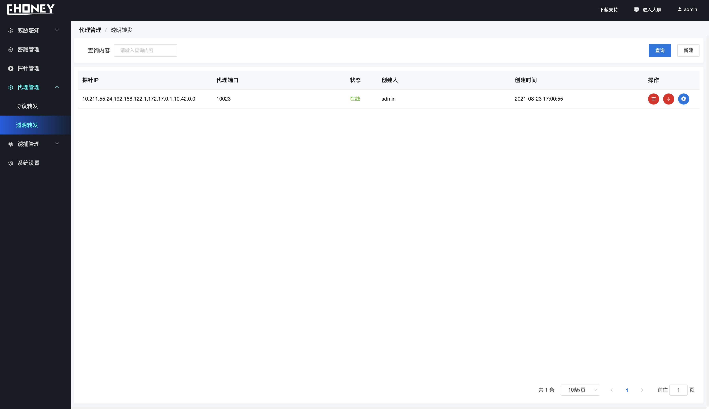

## 透明转发

> 代理管理 >>  透明转发

> 透明转发能够将攻击者的流量从探针转发蜜网服务器

- **字段解释**

1. 探针IP     - 探针IP地址

2. 代理端口 - 透明转发的转发端口
3. 状态         - 蜜罐状态
4. 创建人     - 创建用户 
5. 创建时间- 创建蜜罐时间
6. 操作        - 其他操作

- **功能介绍**

1. 创建透明代理

> 选择对应协议转发以及探针、并选择转发端口

2. 查询操作

> 在查询内容输入框输入查找关键词进行模糊搜索

3. 其他操作

从左到右依次

- 删除透明转发
- 上线、下线透明转发
- 网络探测、探测当前透明转发的状态